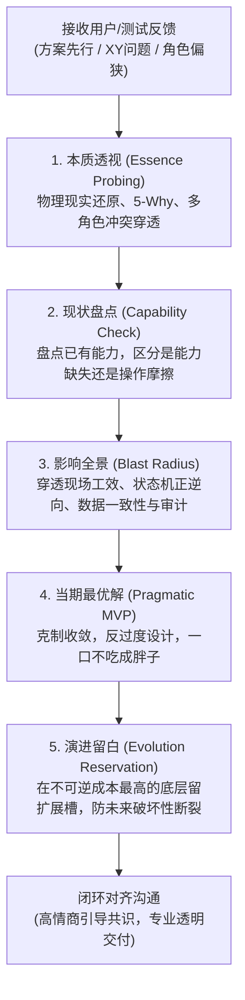

# Demand Essence Loop (需求透视与闭环演进)

> **做事情不是不做，而是如何把事情做好；看透事物本质，不被表象与单角色局限遮蔽；  
> 不搞万事通，不做过度设计；在实现上克制收敛、小步迭代，在不可逆的底层结构上预留演进留白，严防破坏性断裂。**

[](LICENSE)
[](SKILL.md)

`Demand Essence Loop` 是一套**从真实一线高压业务战火中淬炼沉淀而成**的 AI 编程代理工程规范。它旨在帮助开发代理识别真实需求本质、化解 XY 问题与角色偏狭、评估端到端系统影响面，以极简克制的代码交付当期最优解，并在不可逆的底层结构（Schema、状态枚举、API契约）中预留安全演进空间。

---

## 💡 为什么需要本 Skill？

在真实软件开发与测试运行中，需求与反馈往往呈现出**“高频、碎片化、方案先行、单角色偏狭”**的特征。此时工程师与 AI 极易滑向两个极端：

1. **机械照单全收**：提需求者说“加个按钮/加个状态”，就盲目直接加，导致系统充斥平行功能、破坏领域边界、留下难以维护的意大利面条代码。
2. **消极对抗或教条式极简**：以“YAGNI / 架构不支持”为由生硬拒绝；或者盲目硬编码布尔值，三个月后业务微调时，不得不面临全量洗库、停机迁移和接口断裂的灾难。

**Demand Essence Loop 提供了第三条道路：**  
深入理解一线物理现实与角色利益，在实现上做减法（拒绝过度设计），在不可逆的结构层做留白（防御性演进）。

---

## 🔄 核心工作流：五步闭环法 (The 5-Step Essence Loop)



### 1. 本质透视 (Essence Probing)
- **分离四要素**：严格区分事实、期望目标、现实约束与提议手段。
- **物理现场还原**：不假设用户坐在空调办公室。代入一线真实工况（手部油污/水渍、移动设备屏幕与划痕、网络波动、周围环境噪音、排队焦虑感）。
- **利益张力穿透**：一线操作端（求快）、财务审计端（求合规凭证）、调度管理端（求稳定）、终端用户端（求灵活）的多角色博弈。

### 2. 现状盘点 (Capability Check)
- 从代码、Schema、接口和运行行为中找寻事实真理（Source of Truth）。
- 优先通过既有能力组合、信息层级优化或防呆机制解决问题，避免重复开辟功能。

### 3. 影响全景 (Blast Radius)
- 穿透五个层级评估连带代价：移动端现场工效、权限与会话、状态机正逆向完备性、并发与排他锁、财务资金对账与审计。

### 4. 当期最优解 (Pragmatic MVP)
- 反贪大求全，拒绝为刚出现的一个个别诉求构建庞大的通用规则引擎或万能配置系统。
- 明确划分“本次做哪几步、坚决不做哪些延伸”。

### 5. 演进留白 (Evolution Reservation)
- **底层高逆转成本防御四大指南（有条件与代价权衡）**：
  - **状态机枚举留白**：避免用单一布尔值替代生命周期状态；正交业务维度（如加急/置顶）应独立建模；明确分支终态；
  - **Schema 扩展槽（有条件使用）**：仅在探索期轻量属性下使用严格校验的扩展槽；核心不变量直接建模物理列；若现有模型已足够，**“当前无需新增扩展字段”是完全合法且推荐的极简决策**；
  - **API 契约演进**：复合业务接口推荐 Envelope 封装与可选参数以利向后兼容；单标量寻址接口保持直接明了，不搞过度包装；
  - **权威数据源对齐**：基于不可变稳定标识符（Stable ID）与策略授权，严禁依赖可变显示文本。

---

## 🚦 风险分级与适用边界

本 Skill 具备自适应弹性，拒绝形式主义：

| 风险层级 | 典型场景 | 执行动作 |
| :--- | :--- | :--- |
| 🟢 **轻量放行 (Low Risk)** | 纯文案调整、格式排版、局部重命名、无副作用的局部修复 | 快速落地并验证，**不强推繁琐分析与长篇报告** |
| 🟡 **中度对齐 (Medium Risk)** | 局部交互微调、单模块逻辑优化 | 采用轻量决策备忘对齐关键边界 |
| 🔴 **全面闭环 (High Risk)** | 用户方案先行但目标模糊、多角色冲突、涉及 Schema/状态机/资金/权限变更 | **严格执行五步闭环法**，输出完整闭环对齐报告 |

---

## 📂 仓库结构

```text
demand-essence-loop/
├── SKILL.md                                 # 核心入口：规则、工作流、分级标准与自检清单
├── README.md                                # 项目主文档（中英双语）
├── LICENSE                                  # MIT 开源协议
├── agents/
│   └── openai.yaml                          # Agent 接口元数据配置
└── references/
    ├── essence-probing-guide.md             # 需求下潜、物理现场还原与 XY 问题诊断指南
    ├── evolution-without-overengineering.md # 防过度设计与前瞻演进留白实战手册（高逆转成本防御指南）
    └── closed-loop-communication.md         # 闭环沟通规范、报告模板、验证证据与高情商语言禁忌表
```

---

## 🚀 快速上手与安装

### 1. Codex
将本仓库克隆或软链接至 Codex skills 目录：
```bash
git clone https://github.com/huxy2023/demand-essence-loop.git
ln -s "$(pwd)/demand-essence-loop" "$HOME/.codex/skills/demand-essence-loop"
```

### 2. Gemini CLI / Antigravity
将本仓库软链接至 Gemini / Antigravity 配置目录：
```bash
mkdir -p "$HOME/.gemini/config/skills"
ln -s "$(pwd)/demand-essence-loop" "$HOME/.gemini/config/skills/demand-essence-loop"
```

### 3. Claude Code 或其他支持 `SKILL.md` 的代理
将本目录放入相应工具的 skills 路径中即可自动识别。

---

## 💬 高情商沟通艺术（精选预览）

| 业务沟通场景 | ❌ 严禁使用的沟通语气（生硬抵触） | ✅ 推荐使用的沟通语气（共情+引导本质） |
| :--- | :--- | :--- |
| **提了破坏架构的需求** | “这个做不了，系统架构不支持。” | “理解您想在现场快速处理换货的迫切心情（共情）。该诉求的实质是解决现场卡顿；若直接在终端改状态，会带来资金对账与越权风险（揭示客观代价）。我们推荐一种秒级扫码引导方案，既不卡现场，又保证账实相符……” |
| **需求过大过杂** | “你这需求太庞大了，下个版本再说。” | “这个业务方向非常有价值！但如果一口气全部铺开，涉及的抽象过深容易延期。我们本次先做核心主链路 A，同时在底层把扩展槽留好，为后续平滑升级打好底座。” |
| **发现表面需求是伪命题** | “你这个逻辑是错的，根本不需要。” | “通过代入现场具体操作工况，我们发现之所以觉得这里卡顿，根因在于首屏关键信息被长流水号挤占了。因此更精准省力的解法是在首屏突出核心品名与数量……” |

---

## 🌐 English Summary

**Demand Essence Loop** is a battle-tested engineering skill for AI coding agents. It transforms proposed implementations into evidence-based architectural decisions.

### Key Philosophy
- **Uncover the Essence**: Separate what happened, the underlying goal, real-world physical constraints, and the user's proposed implementation (XY Problem).
- **Physical Context Reconstruction**: Empathize with real-world operating environments (oily hands, small screens, glares, poor networks, queue pressure).
- **Pragmatic MVP (Anti-Overengineering)**: Deliver the smallest complete solution for the present. Never build speculative generic rule engines prematurely.
- **Architectural Reservation (Anti-Destruction)**: Keep future evolution open at the most expensive-to-reverse foundation layers (State machine enums, Schema `metadata` reservation slots, API Envelope wrapping, Decoupled concepts from stable IDs) to minimize high-risk breaking migrations and downtime.

---

## 📄 License

[MIT License](LICENSE)
