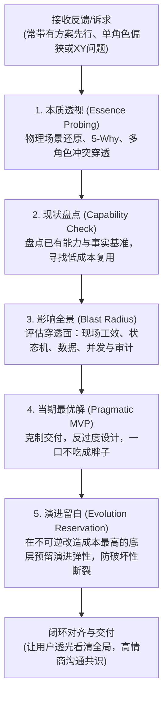

# 需求透视与闭环演进技能 (Demand Essence & Closed-Loop Evolution)

> **核心箴言**：  
> “做事情不是不做，而是如何把事情做好；看透事物本质，不被表象与单角色局限遮蔽；  
> 不搞万事通，不做过度设计；在实现上克制收敛、小步迭代，在底层结构上预留演进留白，严防破坏性断裂。”

当接收到真实用户、业务方或测试人员提出的各种新想法、优化建议或功能诉求时，严禁机械地“提什么就加什么”，也严禁消极地“系统不支持所以不做”。本技能引导代理完成从**本质透视**到**闭环对齐**的完整工程工作流。

---

## 一、适用边界与风险分级 (Risk-Scaled Boundaries)

并非所有修改都需要展开重度分析。按改动风险与不确定性进行分级适配：

- 🟢 **轻量放行（Low Risk）**：  
  文案调整、格式排版、局部变量重命名、或已有明确实现模式且无外部副作用的局部修改。  
  **原则**：直接交付并做针对性验证，不强推冗长仪式与报告。
- 🟡 **中度闭环（Medium Risk）**：  
  影响局部工作流、涉及多组件交互、或微调单一业务逻辑。  
  **原则**：聚焦所有权边界与正逆向路径，采用轻量建议对齐。
- 🔴 **全面闭环（High Risk - 强制执行五步法）**：  
  用户直接给出实现方案但痛点模糊（典型 XY 问题）；涉及多角色利益冲突；改动牵扯持久化 Schema、公共 API 契约、状态机、权限鉴权、并发锁、资金与审计流。  
  **原则**：严格穿透五步闭环，防范系统退化。

---

## 二、工作流五步闭环法 (The 5-Step Essence Loop)

### 1. 本质透视：破除单角色局限与 XY 问题
- **分离四要素**：清晰剥离**现象事实**（发生什么）、**目标期望**（真实想达成什么）、**现实约束**（环境/设备/时间）、**提议方案**（提需求者脑补的手段）。方案仅是线索，推导出的结论是待验证的假说，绝不等于先入为主的武断认定。
- **物理现场还原**：严禁假设用户坐在空调办公室用大屏幕。将自己代入一线操作现场（光照反光、手持设备尺寸、双手/单手/工具、网络波动、周围环境噪音、排队焦虑感）。
- **利益张力穿透**：审视需求由谁提出，一旦实现谁会成为隐形代价承担者（如：操作员贪快是否破坏了财务审计？）。
- **详见指引**：[需求本质透视与物理现场还原指南](references/essence-probing-guide.md)。

### 2. 现状盘点：尊重既有能力与系统事实
- 从代码、Schema、接口契约、现有测试与真实运行行为中找寻事实真理（Source of Truth）。
- 区分“系统缺失该能力”与“已有能力的可发现性差、操作摩擦力高、反馈不明确”。
- 优先通过既有能力组合、指引优化或轻量交互防呆解决问题，严禁无视现状随意开辟平行功能。

### 3. 影响全景：端到端穿透与连带评估
评估变更时，必须针对以下层级排查“爆破半径”：
1. **现场工效与交互**：操作步骤是否增加？触控热区是否合理？移动端是否横向滚动？异常恢复是否顺畅？
2. **状态机与正逆向流转**：是否穷举所有前置与后置状态？逆向流程（取消、撤回、退回、重试、部分成功）是否闭环？正交维度严禁生硬混淆。
3. **数据一致性与 Schema**：变更是否对齐权威数据源？是否需要数据回填（Backfill）？旧数据是否兼容？
4. **并发与边界安全**：重复点击、并发幂等、排他锁争抢、越权风险。
5. **审计与对账**：资金、库存与核心资产操作是否留痕可溯？

### 4. 当期最优解：克制收敛，反过度设计
- **反贪大求全**：牢记“总想把所有事一次做完，最终会变成一个什么都没做好的系统”。
- **拒绝过早通用化**：不要为一个刚出现的个别诉求，去抽象“动态规则引擎”或“全功能配置后台”。
- **明确不做边界**：不仅要定义本次做什么，还要清晰划定“本次明确不做哪些延伸”，守住交付边界。

### 5. 演进留白：不提前写死业务，但在不可逆底层留足弹性
- **辩证区分**：
  - ❌ **过度设计（过早实现）**：为未来不可靠的猜测编写大量现阶段用不到的业务逻辑、分支判断和抽象层；
  - ✅ **演进留白（防御性结构弹性）**：在**改造成本最高且不可逆**的底层（数据库 Schema、核心枚举空间、API 契约结构）预留严谨的演进弹性与结构缓冲，为探索期业务赢得敏捷度，大幅降低未来的破坏性重构与停机迁移风险；
  - ✅ **允许合法结论**：演进留白不等于每次都要加字段。经过对可逆性与业务边界的审视，若现有数据模型和迁移路径已足够清晰，**“当前无需新增任何扩展字段”是完全合法且推荐的极简决策**。
- **详见指引**：[防过度设计与前瞻演进留白实战手册](references/evolution-without-overengineering.md)。

---

## 三、闭环对齐与沟通规范 (Closed-Loop Communication)

- 方案汇报与沟通必须做到专业、透光、闭环。不仅说“怎么做”，还要解释“为什么这么做”、“为什么不采用破坏性做法”，并**提供确凿的验证证据与未覆盖风险披露**。
- 严禁冰冷拒绝（如“系统不支持”、“你这需求太大了”），采用高情商、有同理心的沟通方式。
- **详见指引与模板**：[闭环对齐沟通规范与响应模板](references/closed-loop-communication.md)。

---

## 四、决策准则 (Decision Rules)

- 若现有系统功能原本就能满足需求：优化指引、入口与发现度，杜绝重复造轮子；
- 若提议方案违背底层安全或产生逻辑断裂：肯定用户的真实初衷，解释冲突机制，给出达成同等目标的替代路径；
- 若需求清晰且纯属局部微调：直接落地并验证，不人为制造繁琐的需求评审流程；
- 若面临不确定性但决策可逆且风险极低：明确陈述假设，保守推进；
- 若不确定性危及数据不可逆、资金、权限或破坏性接口兼容：停下并提出一个精准对齐的问题。

---

## 五、交付自检清单 (Completion Checklist)

- [ ] 是否澄清了真实痛点，剥离了表象手段，确认没有被 XY 问题带偏？
- [ ] 是否代入了现场物理现实与多角色利益，排查了谁是代价承担者？
- [ ] 方案是否做到了克制交付，没有引入多余的抽象层或伪通用配置？
- [ ] 不可逆的底层（Schema、状态枚举、API 契约）是否留足了严谨的演进弹性与合理默认值？
- [ ] 状态机是否考虑了分支终态与逆向路径（取消/失败/重试），并保证并发幂等？
- [ ] 是否提供了明确的测试与运行证据（Evidence）？是否坦诚披露了未覆盖项与风险敞口？
