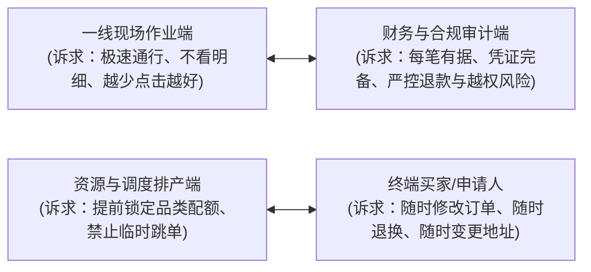

# 需求本质透视与物理现场还原指南 (Essence Probing Guide)

在系统进入真实测试与上线运行阶段时，来自一线用户、业务人员或测试员的反馈往往呈现出**“高频、碎片化、方案先行、单角色偏狭”**的特征。如果缺乏本质透视能力，机械地“提什么就加什么”，系统架构将在短时间内迅速腐化崩塌。

本指南提供一套从表面方案深挖业务痛点、穿透物理现场的实战法则。

---

## 一、警惕两大思维认知陷阱

### 1. 典型的 XY 问题（The XY Problem）
- **现象**：提需求者在物理世界遇到了痛点 **X**，他在脑海中自行脑补了一个实现手段 **Y**，然后向研发提出“我要实现 Y”。
- **危害**：研发如果直接去实现 Y，往往发现 Y 极其别扭、严重破坏既有架构与权限体系，且上线后甚至根本不能彻底解决问题 X。
- **经典实战对照表**：

| 用户提议的表象方案 (Y) | 表面看似的理由 | 深层真实的底层痛点 (X) | 本质解决方案 (真实最优解) |
| :--- | :--- | :--- | :--- |
| **“在列表加个一键强制把单据改为已完成/已核销的按钮”** | 现场赶时间，不想逐一扫码/校验 | 某些提货人没带凭据或手机没电，操作员只知姓名工号，原本的全局搜索链路太深太慢 | 在工作台提供“按工号/姓名极速模糊检索并就地单笔完成”的防呆抽屉，而不是给列表开放全局越权强改状态 |
| **“把所有历史明细全部导出到一个 Excel 宽表里”** | 想要统计核算某个人或某批次的总量 | 列表筛选缺少聚合统计指标，用户需要做临时对账，但人工肉眼看不过来 | 在页面增加当期汇总卡片（总单数、已完成数、待处理数、核心件数），而不是让服务器跑全量大宽表导致内存打爆 |
| **“给系统增加一个‘紧急特批直接过’特殊模式”** | 领导临时需要加急插单，但常规时间窗口已截止 | 业务批次/场次的时间配置过于死板，缺乏针对临时加急的调度排期能力 | 提供批次维度的起止时间微调或加开临时补录批次，而非在商品/任务与订单层硬塞特权状态破坏计价与状态机 |
| **“能否把移动端详情页里的所有字号都放大一倍？”** | 现场核对关键信息看不清 | 详情页混杂了创建时间、长流水号、支付参数等次要信息，核心的品名与数量被淹没在中间 | 根本不需要全局放大字号破坏排版，而是在首屏把【核心名称 × 数量】以醒目大字、加粗徽章形式突出显示，弱化次要流水 |

---

### 2. 单一角色的视野盲区（Single-Role Bias）
不同业务角色的诉求天然存在张力甚至冲突，盲从单一角色必然伤害全链路平衡：

- **透视准则**：在评估任何角色提议前，必须追问两句话：
  1. **“这个改动如果满足了该角色，谁会成为隐形的代价承担者？”**
  2. **“它是否削弱了资金资产安全？是否会导致账实不符？是否会增加现场纠纷？”**

---

## 二、需求下潜与本质还原四步法 (The 4-Deep Steps)

### 第 1 步：场景物理还原（Physical Context Reconstruction）
不要在脑海中假设用户坐在安静明亮的办公室吹空调。必须将自己代入一线物理现实：
- **操作者状态**：是谁在操作？手上有水、油污还是戴着工作手套？单手拿手机还是用扫描枪？
- **物理设备工况**：是 27 寸 4K 办公屏，还是 5.5 寸贴了防窥膜、屏幕充满划痕的老旧移动设备？
- **现场环境条件**：光照强烈反光吗？周围环境嘈杂吗？现场 Wi-Fi/蜂窝网络信号是否只有 1~2 格波动？
- **心理与情绪压力**：后面排着几十号催促的队伍，操作员心里焦不焦虑？一次误操作需要付出多大撤销代价？

### 第 2 步：5-Why 追问根因（Drilling Down with 5-Whys）
层层剥开手段外壳，直抵真实目标：
- 提议：“能不能在表格里加一个复选框，让我能批量勾选然后批量删除？”
  - *Why 1*：为什么要批量删除？——“因为每次导入数据时都有很多重复错误数据。”
  - *Why 2*：为什么会有重复数据？——“外部系统同步过来的数据没有去重机制。”
  - *Why 3*：为什么要在展示层人工找出来删？——“因为不知道哪条是最新的。”
  - **👉 本质结论**：根本不需要在 UI 上做高危的批量物理删除功能，而是在数据接入层依据唯一业务键增加幂等去重与覆盖更新策略。

### 第 3 步：初衷与系统边界校验（Vision & Boundary Check）
- 该需求是否符合系统的核心定位与领域边界？
- 如果一个现场履约自提系统，用户提出“增加顺丰快递单号实时轨迹抓取”：
  - 这就是典型的偏离核心初衷的需求。应当明确系统定位，守住边界，而不是什么都接。

### 第 4 步：区分“硬性痛点”与“伪优化冲动”
- **硬性痛点（Critical Blocker）**：卡死业务闭环、导致账实不符、极高频现场卡顿、引发安全与合规事故——**必须深入解决（通过最优架构解法）**。
- **伪优化冲动（Vanity Tweak）**：“我觉得这里颜色换成深紫更高级”、“能不能让我把按钮拖拽排序”——**礼貌记录，暂不排期，保持系统纯粹**。

---

## 三、与提需求者的高情商探寻原则

- **探寻目标不是审问**：不要像法官审犯人一样连环反问“你为什么想要这个”，这会引发业务方的防御心理；
- **先接纳共情，再引导本质**：“我完全理解您在现场处理换货时排队压力很大（共情）。如果我们在界面直接一键清掉，后续财务对账可能会查不到流水导致扣款异常（揭示风险）。您看如果我们提供一个秒级扫码退换引导，既不卡队伍、对账又是安全的，这样是否更好？”
