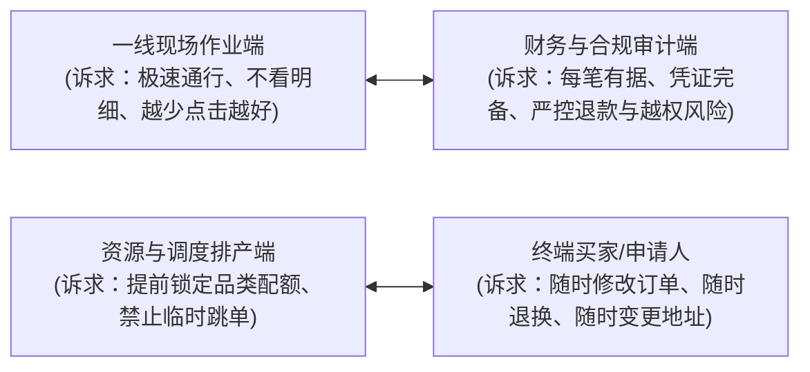

# 需求本质透视与物理现场还原指南 (Essence Probing Guide)

在系统进入真实测试与上线运行阶段时，来自一线用户、业务人员或测试员的反馈往往呈现出**“高频、碎片化、方案先行、单角色偏狭”**的特征。如果缺乏本质透视能力，机械地“提什么就加什么”，系统架构将在短时间内迅速腐化；但如果傲慢地“认定用户全都是伪需求”，则会脱离业务实际。

本指南提供一套从表面方案深挖业务痛点、穿透物理现场的实战探索法则。

---

## 一、警惕两大思维认知陷阱

### 1. 典型的 XY 问题（The XY Problem）
- **现象**：提需求者在业务现场遇到了困难 **X**，他在脑海中自行脑补了一个实现手段 **Y**，然后向研发提出“我要实现 Y”。
- **危害**：研发如果直接去实现 Y，往往发现 Y 极其别扭、破坏现有架构、且上线后甚至不能有效解决原本的问题 X。
- **但切记：推导出的结论是“待验证的假说”，而非不容置疑的“真理”**。

#### 实战推演矩阵（从表象手段到验证假说）：

| 用户提议的表象方案 (Y) | 表面看似的理由 | 潜在深层的业务痛点假说 (X) | 值得深入验证与权衡的候选方案 |
| :--- | :--- | :--- | :--- |
| **“在列表加个按钮，一键把单据强制改成已完成”** | 现场赶时间，不想逐一扫码/校验 | 某些提货人没带凭据或手机没电，操作员只知姓名工号，原本的搜索链路过长 | **优先验证**：现场是否缺乏防呆极速检索？ **候选解**：在工作台提供“按工号/姓名极速模糊检索并就地单笔核销”的受控抽屉，而不是给列表开放全局越权强改。 |
| **“把所有历史明细全部导出到一个 Excel 宽表里”** | 想要统计核算某个人或某批次的总量 | 列表缺少聚合指标，用户需要做对账汇总，但人工肉眼看不过来 | **警惕误判**：不能盲目用汇总卡片粗暴否定导出需求，财务与合规审计**确实需要逐笔核对原始凭证底稿**！ **候选解**：若为了看总数，增加当期汇总指标看板；若确实用于对账，提供带日期分片或异步流式导出的底稿，防止内存溢出。 |
| **“在表格加复选框，允许批量勾选删除数据”** | 导入数据时有大量重复与错误记录 | 历史数据接入时缺乏幂等性，产生了脏数据 | **警惕误判**：去重机制只能防新增重复，**已存在的线上脏数据确实需要被清理**！ **候选解**：在接入层做幂等防新增；对历史脏数据，提供经审批的受控数据修复或隔离归档逻辑，而非直接暴露高危批量物理删除。 |
| **“给系统增加一个‘紧急特批直接过’特殊模式”** | 领导临时加急插单，但常规时间窗口已截止 | 业务批次的时间配置过于死板，缺乏临时调度排期能力 | **优先验证**：加急是高频合理诉求还是偶发例外？ **候选解**：提供批次维度的起止时间微调或加开临时加急批次，避免在商品和订单层硬塞特权状态破坏计价与状态机。 |
| **“能否把移动端详情页里的所有字号都放大一倍？”** | 现场核对关键信息看不清 | 详情页混杂了长流水号、时间等参数，核心信息被淹没 | **优先验证**：是设备分辨率问题还是视觉层级问题？ **候选解**：在首屏将【核心名称 × 数量】以醒目大字、加粗徽章形式突出显示，次要流水后置，优化信息密度。 |

---

### 2. 单一角色的视野盲区（Single-Role Bias）
不同业务角色的诉求天然存在张力甚至冲突，盲从单一角色必然伤害全链路平衡：

- **透视准则**：在评估任何角色提议前，必须追问两句话：
  1. **“这个改动如果满足了该角色，谁会成为隐形的代价承担者？”**
  2. **“它是否削弱了资金资产安全？是否会导致账实不符？是否会增加现场纠纷？”**

---

## 二、需求下潜与本质还原四步法 (The 4-Deep Steps)

### 第 1 步：场景物理还原（Physical Context Reconstruction）
不要在脑海中假设用户坐在安静明亮的办公室吹空调。场景物理还原是**唤醒一线工程同理心、寻找真实约束的工具**，而非先入为主的臆想：
- **操作者状态**：是谁在操作？手上有水、油污还是戴着工作手套？单手拿手机还是用扫描枪？
- **物理设备工况**：是 27 寸 4K 办公屏，还是 5.5 寸贴了防窥膜、屏幕充满划痕的老旧移动设备？
- **现场环境条件**：光照强烈反光吗？周围环境嘈杂吗？现场 Wi-Fi/蜂窝网络信号是否只有 1~2 格波动？
- **心理与情绪压力**：后面排着几十号催促的队伍，操作员心里焦不焦虑？一次误操作需要付出多大撤销代价？

### 第 2 步：5-Why 追问根因（Drilling Down with 5-Whys）
层层剥开手段外壳，直抵真实目标。但**探寻必须基于客观证据与用户事实，切忌变成居高临下的盘问**。

### 第 3 步：初衷与系统边界校验（Vision & Boundary Check）
- 该需求是否符合系统的核心定位与领域边界？
- 如果一个现场履约自提系统，用户提出“增加顺丰快递单号实时轨迹抓取”：
  - 这就是典型的偏离核心初衷的需求。应当明确系统定位，守住边界，而不是什么都接。

### 第 4 步：区分“阻断性硬痛点”与“低频次生需求”
- **阻断性硬痛点（Critical Blocker）**：卡死业务闭环、导致账实不符、极高频现场卡顿、引发安全与合规事故——**必须深入解决（通过最优架构解法）**。
- **低频次生需求（Secondary Requests）**：对主旅程影响有限或带有强烈个人偏好的诉求——**礼貌记录，纳入需求池观察，不打乱当期核心交付节奏**。

---

## 三、假说验证：如何证实你的推导？

在认定用户需求属于 XY 问题之前，必须完成至少一项事实校验：
1. **日志与行为核实**：检查系统中该操作的真实调用频次、失败率与耗时；
2. **数据量级确认**：例如针对“导出全部数据”，先查询该接口涉及的数据行数与单行大小；
3. **关键人对齐**：针对多角色冲突场景，拉齐受影响的下游角色（如财务或现场主管），核实隐性代价是否真实存在。
